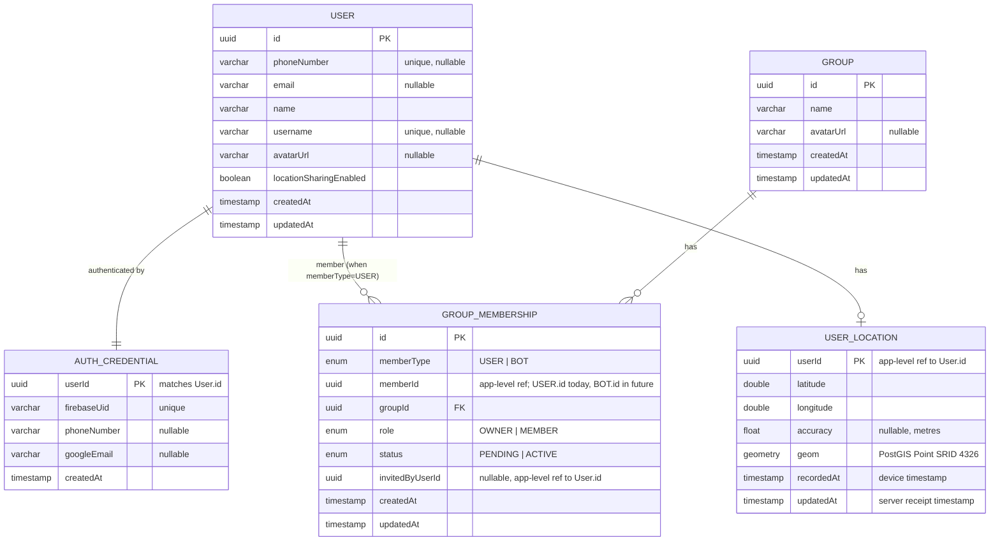

# Domain Model

This document defines the core domain entities, their fields, relationships, and business rules. Entities are logical business concepts — each is owned by one service and maps to tables in that service's database. Cross-service references (e.g. `memberId` in `GROUP_MEMBERSHIP`) are application-level references only; no database-level foreign key constraints exist across service boundaries.

---

## Entity Relationship Diagram

---

## Service Ownership

| Entity | Owning Service | Notes |
|--------|---------------|-------|
| `AUTH_CREDENTIAL` | Auth Service | Auth metadata only; profile lives in User Service |
| `USER` | User Service | |
| `GROUP` | Group Service | |
| `GROUP_MEMBERSHIP` | Group Service | Models both the invite and active membership states |
| `USER_LOCATION` | Location Service | One row per user, upserted on each location update |

---

## Entities

### User
Owned by **User Service**.

| Field | Type | Constraints | Notes |
|-------|------|-------------|-------|
| id | UUID | PK | Shared identifier referenced by all other services |
| phoneNumber | VARCHAR | Unique, nullable | Null for users who registered via Google SSO only |
| email | VARCHAR | Nullable | |
| name | VARCHAR(20) | Not null | Display name; max 20 characters |
| username | VARCHAR | Unique, nullable | Alphanumeric only; set once after registration; immutable thereafter; required for full account activation |
| avatarUrl | VARCHAR | Nullable | Object key / URL of the avatar image in the MinIO object store — not the image bytes |
| locationSharingEnabled | BOOLEAN | Not null, default `true` | Highly consistent — written synchronously to PostgreSQL with no cache layer |
| createdAt | TIMESTAMP | Not null | |
| updatedAt | TIMESTAMP | Not null | |

---

### Auth Credential
Owned by **Auth Service**. Stores the mapping between the app's `userId` and Firebase's identity.

| Field | Type | Constraints | Notes |
|-------|------|-------------|-------|
| userId | UUID | PK | Matches `User.id` — created in the same registration transaction |
| firebaseUid | VARCHAR | Unique, not null | Firebase user identifier used to validate tokens |
| phoneNumber | VARCHAR | Nullable | Used to look up a credential during the OTP flow |
| googleEmail | VARCHAR | Nullable | Used to look up a credential during the Google SSO flow |
| createdAt | TIMESTAMP | Not null | |

---

### Group
Owned by **Group Service**.

| Field | Type | Constraints | Notes |
|-------|------|-------------|-------|
| id | UUID | PK | |
| name | VARCHAR(30) | Not null | Max 30 characters |
| avatarUrl | VARCHAR | Nullable | Object key / URL of the avatar image in the MinIO object store — not the image bytes |
| createdAt | TIMESTAMP | Not null | |
| updatedAt | TIMESTAMP | Not null | |

---

### Group Membership
Owned by **Group Service**. Models both the invite flow and active membership in a single entity using the `status` field. A member is polymorphic — identified by `memberType` + `memberId` — so the same structure accommodates users today and bots later without a schema change.

| Field | Type | Constraints | Notes |
|-------|------|-------------|-------|
| id | UUID | PK | |
| memberType | ENUM | Not null | `USER` or `BOT`. Only `USER` is used today; `BOT` is reserved for the deferred Bots feature |
| memberId | UUID | Not null | Application-level reference to the member. Points to `User.id` when `memberType = USER`; will point to `Bot.id` when `memberType = BOT` |
| groupId | UUID | FK → `Group.id`, not null | |
| role | ENUM | Not null | `OWNER` or `MEMBER` |
| status | ENUM | Not null | `PENDING` — invited, not yet accepted; `ACTIVE` — accepted and visible in group |
| invitedByUserId | UUID | Nullable | Application-level reference to `User.id` of the inviter (invites are always issued by owners, who are users) |
| createdAt | TIMESTAMP | Not null | |
| updatedAt | TIMESTAMP | Not null | |

**Constraints:**
- Unique on `(memberType, memberId, groupId)`.
- A group can have multiple `OWNER`s but must always have at least one.
- A membership record is deleted when a member leaves or is removed — no soft delete.

> **Bots (deferred):** The README lists Bots as a core entity and defines a group as a collection of users *and* bots. Bots are not implemented yet, so no `Bot` entity is modeled here. The polymorphic `memberType` + `memberId` design exists specifically so bots can be added as group members later without restructuring `GROUP_MEMBERSHIP`. Business rules constraining what a bot may do (e.g. whether a bot can hold the `OWNER` role) will be defined when the feature is picked up.

---

### User Location
Owned by **Location Service**. Stores the latest known location per user — one row per user, upserted on every location update. There is no location history; only the current position is retained.

| Field | Type | Constraints | Notes |
|-------|------|-------------|-------|
| userId | UUID | PK | Application-level reference to `User.id` |
| latitude | DOUBLE PRECISION | Not null | |
| longitude | DOUBLE PRECISION | Not null | |
| accuracy | FLOAT | Nullable | GPS accuracy in metres reported by the device |
| geom | GEOMETRY(Point, 4326) | Not null | PostGIS column; always derived from `latitude` and `longitude` at write time |
| recordedAt | TIMESTAMP | Not null | Timestamp from the client device |
| updatedAt | TIMESTAMP | Not null | Timestamp when the server last received an update |

**Indexes:**
- Spatial index on `geom` for PostGIS group centerpoint and nearest-location queries.

---

## Key Business Rules

| Rule | Detail |
|------|--------|
| Account activation gate | A user must set a `username` before the API Gateway allows access to any endpoint other than the username-setting endpoint |
| `username` is immutable | Once set, `username` cannot be changed. It is explicitly excluded from the profile update endpoint |
| Location sharing toggle consistency | `locationSharingEnabled = false` takes effect immediately — no eventual consistency tolerance. The Location Service rejects location updates from users with this flag disabled |
| Group must always have at least one owner | A group can have multiple `OWNER`s. The last remaining owner cannot have their owner status removed — the group must always have at least one `OWNER` |
| Pending members are not visible | A `PENDING` membership (invite not yet accepted) is not included in live location views or group member lists shown to other members |
| `geom` is always derived | The PostGIS `geom` column on `USER_LOCATION` is always computed from `latitude` and `longitude` at write time — never stored independently or updated separately |
| Avatars live in the object store | Avatar image bytes are stored in MinIO, never in PostgreSQL. The `avatarUrl` column on `USER` and `GROUP` holds only the object key / URL |
| No cross-service FK constraints | `memberId`, `userId`, and `groupId` references in services other than their owning service are application-level only — enforced in code, not by the database |
