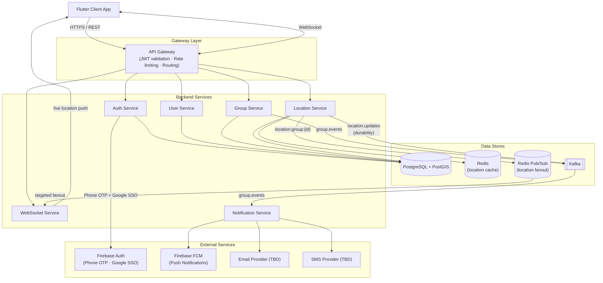

# High Level Architecture

## Overview
Track My Buds is built on a microservices architecture with a Flutter mobile client. Services communicate via REST over HTTPS for standard operations, WebSockets for real-time location delivery, Redis Pub/Sub for targeted location fanout across WebSocket instances, and Kafka for async event streaming between services.

---

## Architecture Diagram

---

## Services

### API Gateway
- Single entry point for all client traffic (REST and WebSocket)
- Validates JWT tokens on every request before forwarding
- Enforces account activation state — rejects requests from accounts without a username set
- Applies rate limiting

### Auth Service
- Handles user registration and login via two flows:
  - **Phone number + OTP**: delegates OTP delivery and verification to Firebase Auth
  - **Google SSO**: delegates to Firebase Auth / Google OAuth
- Issues JWT tokens on successful authentication
- Handles OTP re-verification when a user updates their phone number

### User Service
- Manages user profile fields: name, email, avatar, phone number, locationSharingEnabled
- Phone number updates are gated behind OTP re-verification (coordinated with Auth Service)
- `locationSharingEnabled` changes are written synchronously to PostgreSQL with no eventual consistency tolerance (highly consistent per NFR)

### Group Service
- Manages group lifecycle: create, update name and avatar, delete
- Manages membership: invite user, accept invite, remove member, user self-remove
- Manages ownership: promote user to owner, demote owner
- Publishes events to Kafka topic `group.events` for all membership and ownership changes

### Location Service
- Receives location updates pushed by client devices
- On each location update, writes sequentially:
  1. Persists to PostgreSQL + PostGIS (source of truth) and updates Redis location cache
  2. Resolves the user's group memberships from Redis cache, then publishes to a Redis Pub/Sub channel per group (`location:group:{groupId}`) for real-time WebSocket fanout
  3. Publishes to Kafka topic `location.updates` for durability and audit trail
  - If the Redis Pub/Sub publish fails, the location is still stored; the next device update self-corrects the missed push. This is acceptable given the 30-second consistency NFR.
- Exposes query endpoint for last known location of all users in a group (reads from Redis cache, falls back to PostgreSQL)
- Supports geospatial queries via PostGIS:
  - Group centerpoint (`ST_Centroid` + `ST_Collect` over member locations)
  - Nearest pinned location to the whole group (KNN via `<->` operator or minimum total distance)

### WebSocket Service
- Maintains persistent WebSocket connections with active clients
- Maintains an in-memory map of `groupId → set of locally connected userIds`
- When a client subscribes to a group's live location:
  1. Verifies group membership once via Group Service
  2. Adds the client to the local in-memory map
  3. Subscribes to Redis Pub/Sub channel `location:group:{groupId}` if not already subscribed
- When all local clients for a group disconnect, unsubscribes from that group's Redis Pub/Sub channel
- Receives only events for groups that have at least one locally connected subscriber — no wasted processing of irrelevant group events

### Notification Service
- Consumes `group.events` from Kafka
- Dispatches notifications via three channels for each qualifying event:
  - **FCM** (Firebase Cloud Messaging) — in-app push notification to the target user's device
  - **Email** — via email provider (TBD) for invite and ownership change events
  - **SMS** — via SMS provider (TBD) for invite and ownership change events

---

## Data Stores

### PostgreSQL + PostGIS
Primary database for all persistent data.

| Data | Notes |
|------|-------|
| Users | Profile fields, auth metadata |
| Groups | Name, avatar |
| Group Memberships | User ↔ Group association, ownership flag |
| Location history | lat, long, timestamp per user; PostGIS geometry column for spatial queries |

PostGIS enables:
- `ST_Centroid` + `ST_Collect` — compute centerpoint of all group members' locations
- `<->` KNN operator — find nearest pinned location to group centerpoint
- `SUM(ST_Distance(...))` — find pinned location with minimum total distance to all members

### Redis — Location Cache
- Stores latest known location per user
- Used by Location Service for fast reads when serving live group location view
- Also caches each user's group membership list, used by Location Service to resolve which Pub/Sub channels to publish to on each location update
- PostgreSQL is the source of truth; Redis is eviction-tolerant

### Redis — Pub/Sub
- One channel per group: `location:group:{groupId}`
- Used as the real-time fanout layer between Location Service and WebSocket Service instances
- Messages are fire-and-forget — not persisted; a missed publish self-corrects on the next location update from the device
- WebSocket instances subscribe only to channels for groups they have active local subscribers in, keeping per-instance load proportional to active connections rather than total group count

---

## Message Queue (Kafka)

| Topic | Producer | Consumer | Purpose |
|-------|----------|----------|---------|
| `group.events` | Group Service | Notification Service | Trigger FCM/email/SMS on invite, promote, demote events |
| `location.updates` | Location Service | — | Durability and audit trail for location events; real-time WebSocket fanout is handled by Redis Pub/Sub instead |

---

## External Services

| Purpose | Provider |
|---------|----------|
| Phone OTP (registration + phone number update) | Firebase Auth |
| Google SSO | Firebase Auth / Google OAuth |
| In-app push notifications | Firebase Cloud Messaging (FCM) |
| Email notifications | TBD |
| SMS notifications | TBD |

---

## NFR → Architecture Decisions

| NFR | Architecture Decision |
|-----|-----------------------|
| Login and Signup highly available | Auth Service scaled horizontally behind API Gateway; Firebase Auth handles OTP delivery |
| Location sharing toggle highly consistent | Synchronous write to PostgreSQL; no cache layer for `locationSharingEnabled` field |
| Remove user from group highly available and consistent | Synchronous write to PostgreSQL in Group Service |
| Demote owner highly available and consistent | Synchronous write to PostgreSQL in Group Service |
| Location updates highly available, consistent within 30s | Write to PostgreSQL + Redis cache; publish to Redis Pub/Sub per group for real-time WebSocket push; Kafka for durability |
| Live location reads, max 5 min delay | Served from Redis location cache; cache TTL aligned to 30s location update consistency window |
| Notifications max 5 min delay | Async via Kafka `group.events` → Notification Service → FCM / Email / SMS |
| Group metadata eventually consistent (5 min) | Written to PostgreSQL; no strict cache invalidation required within tolerance |
| User self-remove eventually consistent (5 min) | Written to PostgreSQL; propagated asynchronously |
| Promoting owner eventually consistent (5 min) | Written to PostgreSQL; propagated asynchronously |
