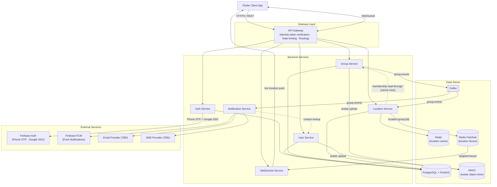

# High Level Architecture

## Overview
Track My Buds is built on a microservices architecture with a Flutter mobile client. Services communicate via REST over HTTPS for standard operations, WebSockets for real-time location delivery, Redis Pub/Sub for targeted location fanout across WebSocket instances, and Kafka for async event streaming between services.

---

## Architecture Diagram


```mermaid
graph TD
    App["Flutter Client App"]

    subgraph Gateway Layer
        GW["API Gateway\n(Identity-token verification · Rate limiting · Routing)"]
    end

    subgraph Backend Services
        AuthSvc["Auth Service"]
        UserSvc["User Service"]
        GroupSvc["Group Service"]
        LocationSvc["Location Service"]
        WSSvc["WebSocket Service"]
        NotifSvc["Notification Service"]
    end

    subgraph Data Stores
        PG[("PostgreSQL + PostGIS")]
        RedisCache[("Redis\n(location cache)")]
        RedisPubSub[("Redis Pub/Sub\n(location fanout)")]
        Kafka[["Kafka"]]
        Blob[("MinIO\n(avatar object store)")]
    end

    subgraph External Services
        FirebaseAuth["Firebase Auth\n(Phone OTP · Google SSO)"]
        FCM["Firebase FCM\n(Push Notifications)"]
        EmailProv["Email Provider (TBD)"]
        SMSProv["SMS Provider (TBD)"]
    end

    App -->|"HTTPS / REST"| GW
    App <-->|"WebSocket"| GW

    GW --> AuthSvc
    GW --> UserSvc
    GW --> GroupSvc
    GW --> LocationSvc
    GW --> WSSvc

    AuthSvc -->|"Phone OTP + Google SSO"| FirebaseAuth

    AuthSvc --> PG
    UserSvc --> PG
    UserSvc -->|"avatar upload"| Blob
    GroupSvc --> PG
    GroupSvc -->|"avatar upload"| Blob
    LocationSvc --> PG
    LocationSvc --> RedisCache
    LocationSvc -->|"location:group:{id}"| RedisPubSub

    GroupSvc -->|"group.events"| Kafka

    Kafka -->|"group.events"| NotifSvc
    Kafka -->|"group.events"| LocationSvc
    LocationSvc -.->|"membership read-through (cache miss)"| GroupSvc
    RedisPubSub -->|"targeted fanout"| WSSvc

    WSSvc -->|"live location push"| App

    NotifSvc -.->|"contact lookup"| UserSvc
    NotifSvc --> FCM
    NotifSvc --> EmailProv
    NotifSvc --> SMSProv
```

---

## Services

### API Gateway
- Single entry point for all client traffic (REST and WebSocket)
- Verifies the caller's identity token on every request through an identity-provider abstraction (Firebase today), resolves the internal `userId` from the `AUTH_CREDENTIAL` mapping (cached in Redis), and forwards it downstream as a trusted `X-User-Id` header
- Enforces account activation state — rejects requests from accounts that have not yet created a profile (no username)
- Applies rate limiting

### Auth Service
- Delegates authentication to an external identity provider — Firebase Auth today, behind a swappable provider-agnostic interface:
  - **Phone number + OTP**: Firebase handles OTP delivery and verification
  - **Google SSO**: Firebase / Google OAuth
- On first login (`POST /auth/session`), verifies the identity token, mints the internal `userId`, and creates the `AUTH_CREDENTIAL` mapping (`providerUid → userId`). Does **not** issue app tokens — the app consumes the provider's identity tokens directly (see Authentication & Authorization below)
- Supports server-initiated session revocation (force logout) through the provider (Firebase Admin SDK today)
- Handles OTP re-verification when a user updates their phone number (delegated to the provider)

### User Service
- Manages user profile fields: name, email, avatar, phone number, locationSharingEnabled
- Phone number updates are gated behind OTP re-verification (coordinated with Auth Service)
- `locationSharingEnabled` changes are written synchronously to PostgreSQL with no eventual consistency tolerance (highly consistent per NFR)

### Group Service
- Manages group lifecycle: create, update name and avatar, delete
- Manages membership: invite user, accept invite, remove member, user self-remove
- Manages ownership: promote user to owner, demote owner
- Publishes events to Kafka topic `group.events` for all membership and ownership changes (single producer). These events drive both notification delivery and the Location Service membership cache — see "Group Event Propagation"
- Exposes an internal read-through endpoint (`GET /internal/users/{userId}/groups`) returning a user's active group ids, used by Location Service to rebuild its membership cache on a cache miss

### Location Service
- Receives location updates pushed by client devices
- On each location update, writes sequentially:
  1. Persists to PostgreSQL + PostGIS (source of truth) and updates Redis location cache
  2. Resolves the user's group memberships from Redis cache, then publishes to a Redis Pub/Sub channel per group (`location:group:{groupId}`) for real-time WebSocket fanout
  - If the Redis Pub/Sub publish fails, the location is still stored; the next device update self-corrects the missed push. This is acceptable given the 30-second consistency NFR.
- Maintains the membership cache it reads in step 2 by consuming `group.events` from Kafka (Group Service owns the data). On a cache miss it rebuilds the set via Group Service's internal read-through endpoint. See "Group Event Propagation"
- Exposes query endpoint for last known location of all users in a group (reads from Redis cache, falls back to PostgreSQL)
- Supports geospatial queries via PostGIS:
  - Group centerpoint (`ST_Centroid` + `ST_Collect` over member locations)
  - Nearest pinned location to the whole group (KNN via `<->` operator or minimum total distance)

### WebSocket Service
- Maintains persistent WebSocket connections with active clients
- Maintains a **reference count per Redis Pub/Sub channel** to manage subscribe/unsubscribe lifecycle
- When a client subscribes to a group's live location:
  1. Verifies group membership once via Group Service
  2. Registers a callback on Redis Pub/Sub channel `location:group:{groupId}` that pushes directly to this client's WebSocket connection; Redis handles routing natively
  3. Increments the ref count for that channel; subscribes to the Redis channel only if ref count goes from 0 → 1
- When a client disconnects or unsubscribes from a group:
  1. Decrements the ref count for that channel
  2. Unsubscribes from the Redis channel only when ref count reaches 0
- Receives only events for channels with active local subscribers — no wasted processing of irrelevant group events

### Notification Service
- Consumes `group.events` from Kafka (acts on `MEMBER_INVITED`, `OWNER_PROMOTED`, `OWNER_DEMOTED`)
- Events carry only ids (no contact details); Notification Service looks up the target user's email and phone from User Service on consume — contact data is owned by User Service and must not be duplicated into events
- Dispatches notifications via three channels for each qualifying event:
  - **FCM** (Firebase Cloud Messaging) — in-app push notification to the target user's device
  - **Email** — via email provider (TBD) for invite and ownership change events
  - **SMS** — via SMS provider (TBD) for invite and ownership change events

---

## Authentication & Authorization

The system delegates authentication to an external identity provider and enforces authorization from its own data (**Model B** — see caveat). The provider is Firebase Auth today, but is accessed behind provider-agnostic interfaces (see "Provider-agnostic by design").

**Authentication (who you are):**
1. The client authenticates with the provider on-device (phone OTP or Google SSO) and receives an identity token. The provider SDK auto-refreshes it on the client.
2. After sign-in the client calls `POST /auth/session`; on first login Auth Service mints the internal `userId` and creates the `AUTH_CREDENTIAL` mapping (`providerUid → userId`).
3. On every subsequent request the client sends the identity token as a Bearer token. The API Gateway verifies it, resolves `userId` from the cached `AUTH_CREDENTIAL` mapping, and forwards `X-User-Id` downstream. Services trust `X-User-Id` because they are reachable only via the Gateway.

**Authorization (what you can do)** is decided by our services from our own data, never from provider token claims:
- **Activation gate** — enforced by the Gateway from a cached activation flag; blocks all but the onboarding endpoints until a profile exists.
- **Group ownership** — Group Service enforces `OWNER`-only actions (invite, promote, demote, remove, update group) by loading the caller's membership and checking `role = OWNER`. This is never delegated to the Gateway, which has no membership knowledge.

**Session revocation (logout):**
- *Ordinary logout* is client-side — the provider SDK clears the token on the device.
- *Server-initiated logout* — Auth Service revokes all of a user's sessions through the provider (`DELETE /auth/sessions`; Firebase Admin SDK `revokeRefreshTokens` today). The Gateway enforces revocation by checking the token against the provider's revocation time during verification.

**Provider-agnostic by design:** Although Firebase is the current identity provider, all APIs and internal interfaces are provider-agnostic. The Gateway and Auth Service depend on interfaces — token verification, first-login provisioning, session revocation — with Firebase as the current adapter. Downstream services only ever see the generic `X-User-Id` principal, never provider tokens or types. `AUTH_CREDENTIAL` stores a generic `provider` + `providerUid` rather than a Firebase-specific field. Swapping providers is isolated to the adapter (and the client SDK).

> **Caveat — revisit at scale.** We consume the provider's identity tokens directly: no app-issued JWT and no refresh-token strategy on our side. This keeps Auth simple but couples request-time auth to the provider. If the product scales or we need custom token semantics, revisit and consider issuing our own app JWT (Model A) with a refresh-token strategy.

---

## Data Stores

### PostgreSQL + PostGIS
Primary database for all persistent data.

| Data | Notes |
|------|-------|
| Users | Profile fields, auth metadata |
| Groups | Name, avatar |
| Group Memberships | User ↔ Group association, ownership flag |
| Latest user location | One row per user (upserted on each update); lat, long, PostGIS geometry column for spatial queries. No location history — only current position is stored. |

PostGIS enables:
- `ST_Centroid` + `ST_Collect` — compute centerpoint of all group members' current locations

### Redis — Location Cache
- Stores latest known location per user
- Used by Location Service for fast reads when serving live group location view
- Also caches each user's **active** group membership list (`user:{userId}:groups` set), used by Location Service to resolve which Pub/Sub channels to publish to on each location update
  - Kept fresh event-driven: Location Service consumes `group.events` and applies `SADD` on `MEMBER_JOINED`, `SREM` on `MEMBER_REMOVED` / `MEMBER_LEFT` (see "Group Event Propagation"). Only `ACTIVE` memberships are cached — `PENDING` invites are not, so invitees receive no location fanout until they accept
  - Read-through on miss: if the set is absent (cold start or eviction), Location Service rebuilds it from Group Service's internal endpoint, then caches it. Group Service's PostgreSQL is the source of truth for membership
- PostgreSQL (location) is the source of truth for location data; Redis is eviction-tolerant

**Cache key schema** (all keys owned by Location Service):

| Key | Redis type | Value | Written on | Read on |
|-----|-----------|-------|-----------|---------|
| `user:{userId}:groups` | Set | The user's **ACTIVE** `groupId`s | `group.events` consume (`SADD`/`SREM`); rebuilt via read-through on miss | Each location update — iterated to derive the `location:group:{groupId}` channels to publish to |
| `user:{userId}:location` | String (JSON) or Hash | Latest location — `latitude`, `longitude`, `accuracy`, `recordedAt`, `updatedAt` | Each location update (step 1) | Live group-location reads (falls back to PostgreSQL on miss) |

Notes:
- The membership Set stores **only `groupId`s** — nothing else is needed on the hot path, since each member maps directly to the channel name `location:group:{groupId}`.
- **Set** (not List) is deliberate: `SADD`/`SREM` are idempotent under Kafka's at-least-once delivery, give O(1) add/remove, and ordering is irrelevant.
- `PENDING` memberships are never added, so the Set reflects exactly the groups eligible for location fanout.
- **TTL** — the location entry represents *last-known location*, so it is **not** expired on the 30s update-consistency window. Freshness comes from each device update overwriting the entry; PostgreSQL is the fallback on miss. TTL exists only as a memory-reclamation bound for long-inactive users (**~24h**), after which reads fall back to PostgreSQL's last-known value. The membership Set is likewise kept event-driven and read-through rather than short-TTL — eviction is tolerated because read-through rebuilds it.

### Redis — Pub/Sub
- One channel per group: `location:group:{groupId}`
- Used as the real-time fanout layer between Location Service and WebSocket Service instances
- Messages are fire-and-forget — not persisted; a missed publish self-corrects on the next location update from the device
- WebSocket instances subscribe only to channels for groups they have active local subscribers in, keeping per-instance load proportional to active connections rather than total group count

### MinIO — Object Store
- S3-compatible object store for binary assets — currently user and group avatar images.
- **Upload:** the client requests a pre-signed upload URL from the owning service (User Service for user avatars, Group Service for group avatars), then uploads the image directly to MinIO. Large binaries never pass through the services.
- **Persistence:** the service stores only the resulting object key / URL on the entity (`User.avatarUrl`, `Group.avatarUrl`) in PostgreSQL — the image bytes live only in the object store.
- **Serve:** avatars are served to clients via the object store URL (pre-signed for private buckets, or direct for public read) — not proxied through the services.
- S3 API compatibility means the same client code targets MinIO locally and any managed S3-compatible store in the cloud with only an endpoint change.

---

## Message Queue (Kafka)

| Topic | Producer | Consumers | Purpose |
|-------|----------|-----------|---------|
| `group.events` | Group Service | Notification Service · Location Service | Fan out group membership & ownership changes to async consumers |

- **Message key:** `groupId`. All events for a group land on the same partition, preserving per-group (and therefore per-`(user, group)`) ordering — e.g. `MEMBER_JOINED` is always processed before a later `MEMBER_REMOVED` for the same member.
- **Delivery:** at-least-once. Consumers are idempotent — Location Service's `SADD`/`SREM` are naturally idempotent; Notification Service dedupes on `eventId`.

See "Group Event Propagation" below for the payload schema and per-consumer behaviour.

---

## Group Event Propagation

`group.events` is the single stream through which Group Service publishes every membership and ownership change. It has two independent consumers, each acting on the subset of event types it cares about:

- **Notification Service** — sends FCM / email / SMS.
- **Location Service** — keeps its Redis active-membership cache in sync so location fanout targets the right groups.

Making one topic serve both consumers avoids a second propagation mechanism and guarantees the two views derive from the same ordered event log.

### Event envelope

Every event shares a common envelope; `payload` fields vary by `type`.

```json
{
  "eventId": "9f1c...-uuid",          // unique per event; consumer idempotency key
  "type": "MEMBER_JOINED",            // see event types below
  "occurredAt": "2026-07-31T10:15:30Z",
  "groupId": "...-uuid",
  "groupName": "Weekend Trip",        // denormalized; owned by Group Service, so no cross-service fetch
  "actorUserId": "...-uuid",          // user who performed the action; null for system-driven
  "payload": {
    "memberType": "USER",             // USER today; BOT reserved (see domain model)
    "memberId": "...-uuid",           // the affected member (User.id today)
    "invitedByUserId": "...-uuid"     // event-specific; present on MEMBER_INVITED
  }
}
```

Design rule: **events carry ids only, never contact details** (email/phone). Those are owned by User Service; Notification Service fetches them on consume. This keeps Group Service from reaching into User Service at publish time and prevents stale contact data in the log.

### Event types and consumer behaviour

| `type` | Emitted when | Notification Service | Location Service (membership cache) |
|--------|--------------|----------------------|-------------------------------------|
| `MEMBER_INVITED` | Owner invites a user (creates a `PENDING` membership) | Notify invitee (invite) | Ignored — `PENDING` is not cached |
| `MEMBER_JOINED` | Invitee accepts (`PENDING` → `ACTIVE`) | — | `SADD user:{memberId}:groups {groupId}` |
| `MEMBER_REMOVED` | Owner removes a member | — | `SREM user:{memberId}:groups {groupId}` |
| `MEMBER_LEFT` | Member self-removes | — | `SREM user:{memberId}:groups {groupId}` |
| `OWNER_PROMOTED` | Member promoted to owner | Notify promoted user | Ignored — role change, membership set unchanged |
| `OWNER_DEMOTED` | Owner demoted to member | Notify demoted user | Ignored — role change, membership set unchanged |
| `GROUP_DELETED` | Group is deleted | — | Removal handled per member (see note) |

> **Group deletion:** deleting a group emits a `MEMBER_REMOVED` for each active member (rather than a single `GROUP_DELETED` the Location Service would have to expand), so the cache-maintenance logic stays uniform — every membership removal is one `SREM`. `GROUP_DELETED` is reserved for future consumers that need the group-level signal.

### Read-through fallback (cache miss)

The event stream keeps the cache fresh incrementally but does not repopulate a cold or evicted cache. On a miss for `user:{userId}:groups`, Location Service calls Group Service's internal endpoint `GET /internal/users/{userId}/groups` (active memberships only), caches the result, and proceeds. Group Service's PostgreSQL remains the source of truth for membership; Kafka handles the deltas, read-through handles the baseline.

---

## External Services

| Purpose | Provider |
|---------|----------|
| Phone OTP (registration + phone number update) | Firebase Auth |
| Google SSO | Firebase Auth / Google OAuth |
| In-app push notifications | Firebase Cloud Messaging (FCM) |
| Email notifications | TBD |
| SMS notifications | TBD |

---

## NFR → Architecture Decisions

| NFR | Architecture Decision |
|-----|-----------------------|
| Login and Signup highly available | Auth Service scaled horizontally behind API Gateway; Firebase Auth handles OTP delivery |
| Location sharing toggle highly consistent | Synchronous write to PostgreSQL; no cache layer for `locationSharingEnabled` field |
| Remove user from group highly available and consistent | Synchronous write to PostgreSQL in Group Service |
| Demote owner highly available and consistent | Synchronous write to PostgreSQL in Group Service |
| Location updates highly available, consistent within 30s | Write to PostgreSQL + Redis cache; publish to Redis Pub/Sub per group for real-time WebSocket push |
| Live location reads, max 5 min delay | Served from Redis location cache (last-known location); each device update overwrites the entry, so freshness is driven by write frequency, not TTL. The cache falls back to PostgreSQL on miss |
| Notifications max 5 min delay | Async via Kafka `group.events` → Notification Service → FCM / Email / SMS |
| Group metadata eventually consistent (5 min) | Written to PostgreSQL; no strict cache invalidation required within tolerance |
| User self-remove eventually consistent (5 min) | Written to PostgreSQL; propagated asynchronously |
| Promoting owner eventually consistent (5 min) | Written to PostgreSQL; propagated asynchronously |
